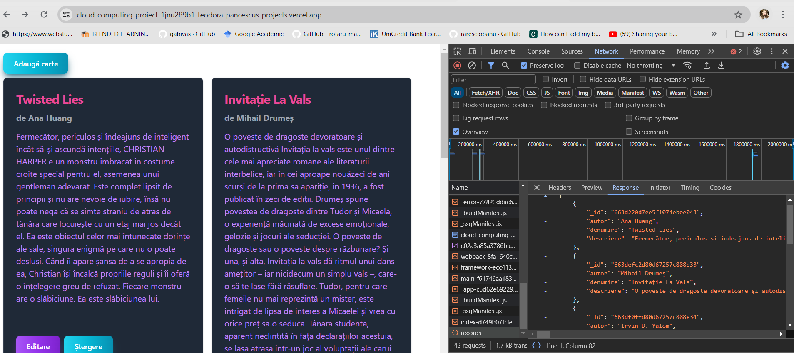
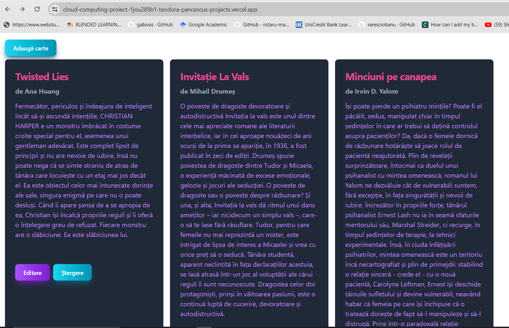
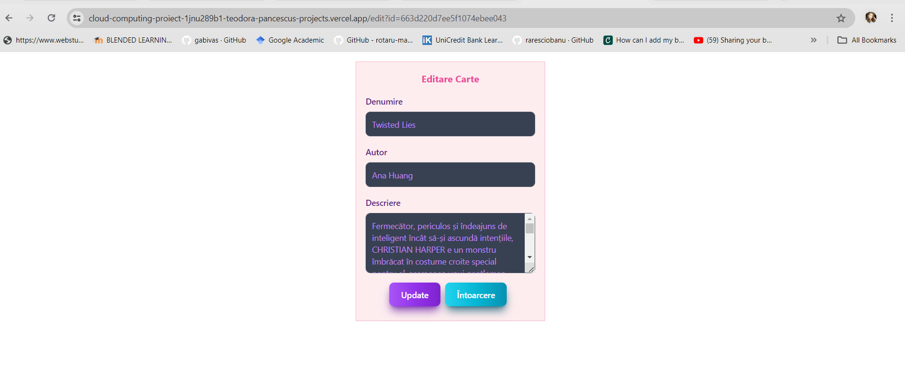

Proiect Cloud Computing - Aplicație pentru gestionarea unei biblioteci folosind servicii de Cloud
Studentă: Păncescu Teodora
Grupa: 1132

1. Introducere

În zilele noastre, conceptul de Cloud Computing a devenit nu doar o abstracție tehnologică, ci o prezență fundamentală în viețile noastre digitale. Este precum un depozit virtual imens pentru datele noastre, accesibil la doar câteva click-uri distanță prin intermediul internetului. Dar Cloud-ul nu este doar despre stocarea datelor; reprezintă o paradigmă a flexibilității și scalabilității în lumea tehnologiei.

Flexibilitatea și scalabilitatea sunt două caracteristici cheie care definesc avantajele majore ale tehnologiei Cloud. Această paradigmă ne permite să adaptăm rapid resursele de calcul și de stocare în funcție de nevoile noastre, fără a depinde de infrastructura locală costisitoare. Indiferent că suntem o afacere în expansiune sau un utilizator individual, Cloud-ul ne oferă libertatea de a crește sau de a micșora infrastructura în funcție de cerințe.

Un alt avantaj al tehnologiei Cloud este fiabilitatea și redundanța pe care o aduce în gestionarea datelor noastre. Prin distribuirea acestora pe mai multe servere și centre de date, riscul de pierdere a datelor sau de întrerupere a serviciilor este redus semnificativ. Astfel, ne putem baza cu încredere că datele noastre sunt în siguranță și accesibile în orice moment, indiferent de circumstanțe.

Cloud Computing-ul reprezintă un salt în abordarea infrastructurii IT pentru întreprinderi. Prin utilizarea acestuia, companiile pot accesa și utiliza resursele IT fără a investi masiv în infrastructură propriu-zisă. Alegând să utilizeze serviciile disponibile prin internet și plătind în funcție de utilizarea efectivă, acestea obțin o flexibilitate și scalabilitate sporite.

De asemenea, pentru utilizatorii individuali, Cloud-ul aduce o serie de avantaje semnificative. În loc să investească în echipamente și sisteme IT învechite, aceștia pot să-și concentreze resursele și atenția asupra activităților strategice. Fără a fi nevoie de o investiție inițială mare, pot accesa rapid resursele de calcul de care au nevoie și plătesc doar pentru ceea ce utilizează în mod efectiv.

2. Descriere Problemă
În era agitată în care trăim, găsirea unei cărți preferate în biblioteca personală poate fi uneori o provocare. Aplicația dezvoltată de mine își propune să rezolve această problemă prin combinarea a două servicii de Cloud Computing, MongoDB Atlas si Vercel, transformând modul în care cărțile din bibliotecă pot fi accesate.

Gândită pentru pasionații de lectură, această aplicație facilitează adunarea întregii colecții de cărți într-un singur loc accesibil. Utilizatorii pot vizualiza titlurile, autorii și descrierile cărților, astfel încât să fie mereu la curent cu cărțile pe care le au la îndemână și cu cele pe care intenționează să le citească.

Flexibilitatea reprezintă unul dintre avantajele de seamă ale acestei aplicații. Utilizatorii au posibilitatea să acceseze rapid biblioteca lor de cărți de pe orice dispozitiv conectat la internet, aplicația fiind una responsive. Mai mult decât atât, aceștia pot adăuga noi cărți, edita detaliile celor deja existente în baza de date și șterge cărți, oferindu-le controlul complet asupra colecției lor literare.

Din punctul meu de vedere, această aplicație reprezintă un partener de încredere pentru toți iubitorii de cărți, făcându-le viața mai ușoară și mai organizată. Cu ajutorul tehnologiilor Cloud, pasiunea pentru lectură poate fi explorată și bucurată mai ușor ca niciodată.

3. Tehnologiile folosite
a. MongoDB Atlas și MongoDB Compass

MongoDB Atlas este un serviciu de bază de date multi-cloud oferit de aceeași echipă care a creat MongoDB. Atlas simplifică implementarea și gestionarea bazelor de date, oferind în același timp versatilitatea necesară pentru construirea aplicațiilor globale rezistente și performante pe furnizorii de cloud aleși.

Principalele avantaje ale MongoDB Atlas sunt:

1. Găzduire completă în Cloud: MongoDB Atlas oferă un serviciu complet gestionat pentru bazele de date MongoDB în Cloud.Utilizatorii nu trebuie să își facă griji cu privire la configurarea și întreținerea infrastructurii fizice sau virtuale. Aceștia se pot concentra pe dezvoltarea aplicațiilor, iar Atlas va gestiona restul.

2. Ușurință în configurare: Configurarea unei instanțe MongoDB în Atlas este simplă și rapidă. Cu câteva click-uri sau câteva comenzi de la linia de comandă, se poate obține o bază de date MongoDB operațională, gata să fie utilizată pentru aplicație.

3. Scalabilitate elastică: MongoDB Atlas oferă opțiuni flexibile de scalabilitate, permițând creșterea sau micșorarea resurselor în funcție de nevoile aplicației. 

4. Securitate avansată: MongoDB Atlas oferă opțiuni puternice de securitate, inclusiv autentificare avansată, autorizare bazată pe roluri și criptare a datelor în tranzit și în repaus. De asemenea, include funcționalități de auditare și de monitorizare a securității pentru a ajuta la menținerea datelor în siguranță.

6. Backup și redresare automată: Atlas oferă funcționalități automate de backup și redresare pentru datele utilizatorilor. Acest lucru oferă siguranța că datele sunt protejate împotriva pierderilor și că se poate reveni rapid la o stare funcțională în caz de eșec.

7. Integrare cu alte servicii Cloud: MongoDB Atlas se integrează bine cu alte servicii Cloud populare, cum ar fi AWS, Azure și Google Cloud Platform. Aceasta permite dezvoltarea aplicațiilor complexe și scalabile, beneficiind de avantajele ecosistemului Cloud.

MongoDB Compass este o interfață grafică avansată care permite interogarea, agregarea și analizarea datelor din baza de date MongoDB într-un mod vizual intuitiv. Prin utilizarea acestei interfețe, utilizatorii beneficiază de oportunitatea de a explora și manipula datele într-un mod intuitiv, convenabil și gratuit, având accesibilitate pe diverse sisteme de operare, precum: macOS, Windows și Linux.

b. Vercel 
Vercel (fost cunoscut sub numele de ZEIT) este o platformă cloud care permite dezvoltatorilor să găzduiască site-uri web și servicii web care se implementează instantaneu, scalează automat și nu necesită supraveghere. Fondată în 2015 de către Guillermo Rauch, platforma oferă o interfață intuitivă cu o configurație minimă pentru găzduirea generatorilor de site-uri statice precum Gatsby sau Hugo și a diferitelor CMS-uri precum Contentful, Prismic sau WordPress. Vercel este și compania-mamă a framework-ului Next.js - și vine cu multe caracteristici interesante:

1. Performanță și scalabilitate: Vercel oferă un mediu de hosting global și scalabil, distribuit pe o rețea de servere, asigurând performanță ridicată și acces rapid la aplicații în întreaga lume.

2. Desfășurare continuă simplificată: Platforma facilitează procesul de desfășurare continuă (CI/CD) prin integrarea strânsă cu sistemele de control al versiunilor, precum Git, permițând implementarea automată a modificărilor codului în producție în timp real.

3. Suport extins pentru tehnologii web: Vercel acceptă o gamă largă de tehnologii web populare, oferind flexibilitate dezvoltatorilor pentru a utiliza instrumentele și limbajele de programare preferate.

4. Securitate avansată: Platforma oferă funcționalități de securitate avansate, inclusiv criptare SSL automată, protecție împotriva atacurilor DDoS și monitorizare a securității în timp real, pentru a asigura protejarea aplicațiilor împotriva amenințărilor cibernetice.

5. Analize și monitorizare: Vercel furnizează instrumente de analiză și monitorizare a performanței aplicațiilor, permițând dezvoltatorilor să optimizeze performanța și disponibilitatea aplicațiilor lor în timp real.

6. Integrare simplă cu alte servicii: Platforma se integrează ușor cu diverse servicii terțe populare, precum GitHub, GitLab, Bitbucket și Slack, facilitând colaborarea și gestionarea proiectelor în echipă.

c. Next.js
Next.js este un framework de dezvoltare web React cu sursă deschisă, construit pentru a simplifica și accelera procesul de creare a aplicațiilor web moderne. Next.js este o alegere excelentă pentru dezvoltatorii care doresc să creeze aplicații web moderne și performante, beneficiind de un set extins de caracteristici și avantaje care facilitează și accelerează procesul de dezvoltare:

1. Renderizare universală (server-side rendering - SSR/client-side rendering - CSR): Next.js permite renderizarea atât pe server, cât și pe client, ceea ce îmbunătățește timpul de încărcare al paginilor și optimizează experiența utilizatorului.

2. Routing dinamic: Next.js oferă un sistem de rutare dinamică care permite definirea rutelor și așezarea paginilor în mod flexibil, facilitând dezvoltarea aplicațiilor web complexe.

3. Suport pentru server API integrat: Include un server API integrat, care permite dezvoltatorilor să creeze și să gestioneze servicii API pe același server utilizat pentru aplicația lor web.

4. Scalabilitate și performanță: Datorită abilității de a gestiona renderizarea atât pe server, cât și pe client, Next.js oferă o scalabilitate excelentă și o performanță de vârf pentru aplicațiile web de orice dimensiune.

5. Comunitate activă și suport extins: Next.js beneficiază de o comunitate activă de dezvoltatori și întreprinderi, iar documentația bogată și suportul continuu asigură o experiență de dezvoltare fără probleme.

4. Flux de date
Exemple de request/response
Câteva exemple de cereri și răspunsuri, acestea reprezentând si endpoint-uri principale, care se regăsesc în aplicația mea sunt următoarele:
-GET /
Cerere: Un client trimite o cerere GET către server pentru a obține lista tuturor cărților din bibliotecă.
Răspuns: Serverul trimite înapoi o listă de cărți în format JSON, fiecare carte fiind reprezentată printr-un obiect care conține informații despre titlu, autor, descriere.

-POST /create
Cerere: Un client trimite o cerere POST către server pentru a adăuga o nouă carte în bibliotecă.
Corpul cererii: Datele despre noua carte, cum ar fi titlul, autorul, descrierera sunt incluse în corpul cererii în format JSON.
Răspuns: Serverul trimite înapoi un răspuns JSON pentru a confirma adăugarea cărții sau pentru a indica orice eroare care ar putea apărea în timpul procesului.

-PUT /edit/{id}
Cerere: Un client trimite o cerere PUT către server pentru a actualiza informațiile unei cărți existente în bibliotecă.
Parametri: ID-ul cărții care urmează să fie actualizată este specificat în cadrul căii (path-ul) URL-ului.
Corpul cererii: Datele actualizate despre carte, precum și modificările dorite, sunt incluse în corpul cererii în format JSON.
Răspuns: Serverul trimite înapoi un răspuns JSON pentru a confirma actualizarea cărții sau pentru a indica orice eroare care ar putea apărea în timpul procesului.

-DELETE /records/{id}
Cerere: Un client trimite o cerere DELETE către server pentru a șterge o carte din bibliotecă.
Parametri: ID-ul cărții care urmează să fie ștearsă este specificat în cadrul path-ului URL-ului.
Răspuns: Serverul trimite înapoi un răspuns JSON pentru a confirma ștergerea cărții sau pentru a indica orice eroare care ar putea apărea în timpul procesului.

Metode HTTP
În aplicașie se regăsesc câteva funcții care sunt utilizate pentru a trimite răspunsuri HTTP corespunzătoare în funcție de diversele situații care pot apărea în cadrul oricărei aplicații web:
-sendOk(res, data):
Descriere: Această metodă este utilizată pentru a trimite un răspuns HTTP de tipul 200 OK, semnalând că cererea a fost îndeplinită cu succes.
Utilizare: Pentru a trimite un răspuns de succes atunci când o cerere este procesată corect și rezultatul este disponibil.

-sendNotFound(res, message):
Descriere: Această funcție este utilizată pentru a trimite un răspuns HTTP de tipul 404 Not Found, semnalând că resursa cerută nu a fost găsită în server.
Utilizare: Atunci când o cerere este făcută pentru o resursă inexistentă sau care nu poate fi găsită în server.

-sendBadRequest(res, message):
Descriere: Această funcție este utilizată pentru a trimite un răspuns HTTP de tipul 400 Bad Request, semnalând că cererea făcută de utilizator este invalidă sau nu poate fi procesată de server.
Utilizare: Atunci când cererea făcută de utilizator este incompletă, incorectă sau conține date invalide.

-sendUnauthorized(res, message):
Descriere: Această funcție este utilizată pentru a trimite un răspuns HTTP de tipul 401 Unauthorized, semnalând că cererea nu poate fi procesată deoarece nu există autentificare validă sau accesul este refuzat pentru utilizator.
Utilizare: Atunci când un utilizator încearcă să acceseze o resursă protejată fără a fi autentificat sau autorizat.

-sendMethodNotAllowed(res, message):
Descriere: Această funcție este utilizată pentru a trimite un răspuns HTTP de tipul 405 Method Not Allowed, semnalând că metoda HTTP utilizată în cerere nu este acceptată pentru resursa respectivă.
Utilizare: Atunci când utilizatorul folosește o metodă HTTP (GET, POST, PUT, DELETE etc.) care nu este permisă pentru resursa cerută.

5. Capturi de ecran aplicație

Referințe:
1. https://mongodb.com/docs/atlas/
2. https://www.mongodb.com/docs/compass/current/
3. Amit Phaltankar, Juned Ahsan, Michael Harrison, Liviu Nedov: "MongoDB Fundamentals: A hands-on guide to using MongoDB and Atlas in the real world"
4. https://www.getfishtank.com/blog/what-is-vercel
5. https://intuji.com/what-is-vercel-is-it-the-right-platform-for-front-end-developers/
6. https://medium.com/@asiandigitalhub/what-is-next-js-and-its-benefits-8b13aab56bfd

